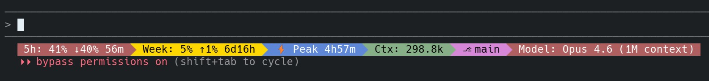

# ccstatusline Budget Widgets

Custom widgets for [ccstatusline](https://github.com/sirmalloc/ccstatusline) that help you track Claude Code usage budget and peak hours.



## Install

Requires [ccstatusline](https://github.com/sirmalloc/ccstatusline) to be already installed.

```bash
npx ccstatusline-budget-widgets
```

This copies the widget scripts to `~/.config/ccstatusline/` and auto-patches your `settings.json`.

## Widgets

### `usage-5h` — 5-Hour Session Budget

Shows current 5-hour session usage with a surplus/deficit indicator.

```
5h: 32% ↓34%
```

- `↓34%` — usage is 34% **below** expected pace (you have room)
- `↑15%` — usage is 15% **above** expected pace (burning fast)

Compares actual usage against where you *should* be based on elapsed time in the 5-hour window. If you've used 20% but 60% of the window has passed, you're `↓40%` under budget.

### `usage-weekly` — Weekly Budget

Same concept applied to the 7-day rolling window.

```
Week: 27% ↓9%
```

### `peak-hours` — Peak Hours Indicator

Shows whether Anthropic's peak pricing hours are active, with a countdown.

```
⚡ Peak 3h20m       ← peak hours, 3h20m until off-peak
Off-peak 17h37m     ← off-peak, 17h37m until next peak
```

Peak hours: **weekdays 5am–11am PT** (1pm–7pm GMT). During peak hours, 5-hour session limits are consumed faster.

## Uninstall

Remove the widget files and their entries from settings:

```bash
rm ~/.config/ccstatusline/usage-5h.js ~/.config/ccstatusline/usage-weekly.js ~/.config/ccstatusline/peak-hours.js
```

Then remove the corresponding `custom-command` entries from `~/.config/ccstatusline/settings.json`, or restore the backup at `settings.json.bak`.

## How the budget indicator works

```
Expected usage = (elapsed time / total window) × 100%
Surplus = expected − actual

↓ = under budget (good — you have headroom)
↑ = over budget (watch out — burning fast)
```

## Requirements

- [ccstatusline](https://github.com/sirmalloc/ccstatusline)
- Node.js

## License

MIT
